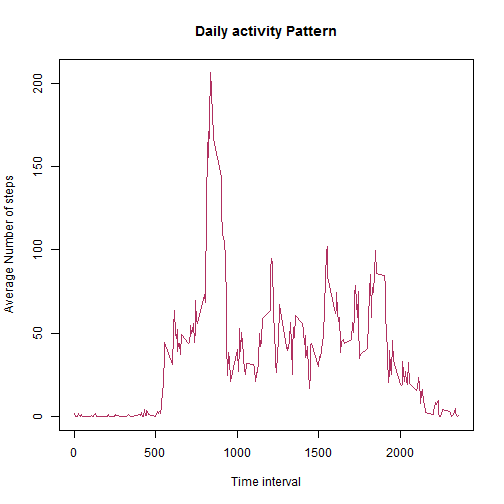

Peer Assignment 1
========================================================


This assignment makes use of data from a personal activity monitoring device. This device collects data at 5 minute intervals through out the day. The data consists of two months of data from an anonymous individual collected during the months of October and November, 2012 and include the number of steps taken in 5 minute intervals each day.

The variables included in the given  Activity monitoring data  dataset are:

steps: Number of steps taking in a 5-minute interval (missing values are coded as NA)

date: The date on which the measurement was taken in YYYY-MM-DD format

interval: Identifier for the 5-minute interval in which measurement was taken

In order to proceed as mentioned in the assignment,
Loading the data from given csv pre downloaded to a directory which is also set as the working directory for the given assignment.


```r
## data reading
rawactivity <- read.csv("./activity.csv", stringsAsFactors = FALSE)
rawactivity[, "date"] <- as.Date(rawactivity[, "date"], format = "%Y-%m-%d")
```


Displaying the required Histogram, mean and median of total number of steps taken

```r
## mean median histogram getting aggregate data under observation by day and
## removing NA values
stepsbyday <- aggregate(steps ~ date, data = rawactivity, FUN = sum, na.rm = TRUE)
## plotting the desired histogram
hist(stepsbyday$steps, breaks = nrow(stepsbyday), main = "Number of steps per day", 
    xlab = "date", ylab = "steps", col = "red")
```

 

```r
## calculating the requested mean and median
meanstep <- round(mean(stepsbyday$steps), 3)
medianstep <- median(stepsbyday$steps)
```

The mean of total number of steps per day is: 1.0766 &times; 10<sup>4</sup>  
The median of number of steps per day is: 10765


Daily activity pattern starts with aggregation of data across all days grouped over intervals, followed by ploting of the line graph showing activity and thus calculating time interval where max number of mean step is being observed


```r
## daily activity pattern
vals <- aggregate(steps ~ interval, data = rawactivity, FUN = mean, na.rm = TRUE)
## avg number of steps by interval plot for the above case
plot(vals$interval, vals$steps, type = "l", xlab = "Time interval", ylab = "Average Number of steps", 
    col = "maroon")
```

 

```r
mxstpint <- vals$interval[vals$steps == max(vals$steps)]
## calc interval where avg number of steps are max
```

The average number of steps where maximum at 835 time interval


The process for imputing is :
first finding the number of NA values
then based on indexes which are being cross refrenced using is.na we impute means for that particular interval(Assumption made for imputing logic is that people are assumed to be taking same number of steps for that particular interval)
the rest part is similar to the first part we did.


```r
## Imputing missing values
iNA <- is.na(rawactivity$steps)  ##index for NA
nNA <- sum(iNA)  ##number of NAs
ntNA <- sum(!iNA)  ##number of non NAs
pcNA <- round(nNA/(nNA + ntNA), 4)  ##percentage of NA
comactivity <- rawactivity

comactivity[iNA, ]$steps <- vals[match(rawactivity[iNA, ]$interval, vals$interval), 
    ]$steps

comactivity$steps <- round(comactivity$steps)  ##since number of steps would be in whole number,thus rounded
nstepsbyday <- aggregate(steps ~ date, data = comactivity, FUN = sum, na.rm = TRUE)

hist(nstepsbyday$steps, breaks = nrow(nstepsbyday), main = "Number of steps per day", 
    xlab = "date", ylab = "steps", col = "orange")
```

 

```r
nvals <- aggregate(steps ~ interval, data = comactivity, FUN = mean, na.rm = TRUE)
nmeanstep <- round(mean(nstepsbyday$steps), 3)
nmedianstep <- median(nstepsbyday$steps)
```


the total number of NA is 2304 with percentage of NA corresponding to given data is 0.1311%

The new mean of total number of steps per day is: 1.0766 &times; 10<sup>4</sup>  
The new median of number of steps per day is: 1.0762 &times; 10<sup>4</sup> 

the difference in value observed is 0.5 step for mean and 3 for median, which can be due to input of new data alongwith the rounding off differences.


TO plot this graph we had to add new columns to define day of the week and type of day(either weekday or weekend) for ease of the computation

```r
comactivity$wday <- weekdays(comactivity$date)  ##adding day of the week
dtype <- rep("Weekday", nrow(comactivity))
dtype <- factor(dtype, levels = c("Weekend", "Weekday"))
comactivity <- cbind(comactivity, dtype)  ##making a column for type of day
comactivity$dtype <- rep("Weekday", nrow(comactivity))
comactivity[comactivity$wday == "Saturday" | comactivity$wday == "Sunday", ]$dtype <- "Weekend"  ##segregating into weekday or weekend
wdact <- subset(comactivity, dtype == "Weekday")  ##getting weekday data
wnact <- subset(comactivity, dtype == "Weekend")  ##getting weekend data


aidval <- aggregate(comactivity$steps, by = comactivity[c("interval", "dtype")], 
    FUN = (step = mean))  ## aggregate data set for the required plot 

library(lattice)
library(ggplot2)
## required plot
xyplot(x ~ interval | dtype, data = aidval, layout = c(1, 2), type = "l", ylab = "Mean of steps per time interval", 
    xlab = "time interval", main = "Weekend Vs Weekday Comparison across time interval")
```

 

```r

## aggregation based on dates for weekdays and weekend
wdstepsbyday <- aggregate(steps ~ date, data = wdact, FUN = sum, na.rm = TRUE)
wnstepsbyday <- aggregate(steps ~ date, data = wnact, FUN = sum, na.rm = TRUE)
wdmeanstep <- round(mean(wdstepsbyday$steps), 3)
wnmeanstep <- mean(wnstepsbyday$steps)
```


The mean of total number of steps per weekday is: 1.0255 &times; 10<sup>4</sup>
The mean of total number of steps per weekend is: 1.2201 &times; 10<sup>4</sup>
The number of steps taken on a weekend are more than a weekend based on the values


END
================================================================================
